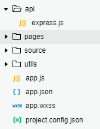
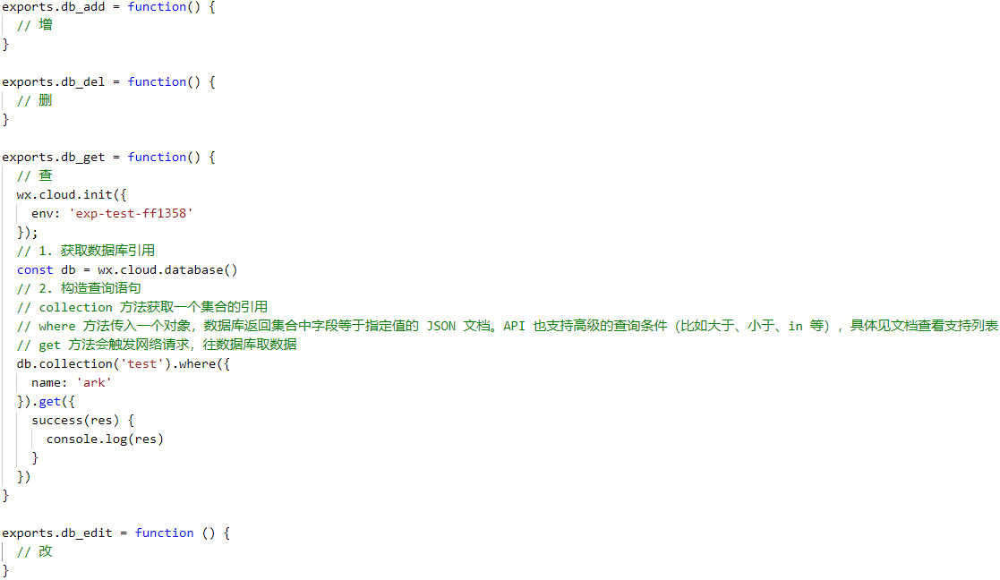
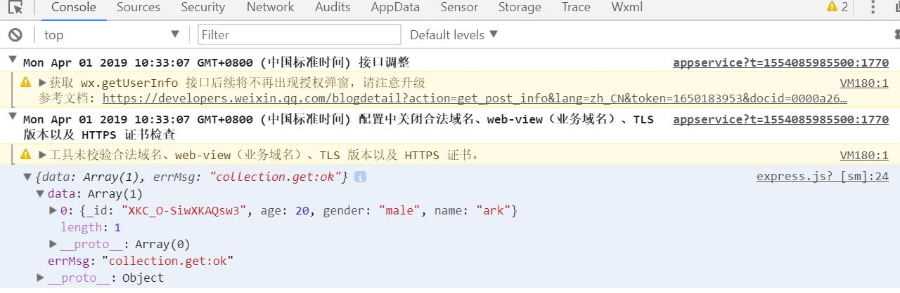
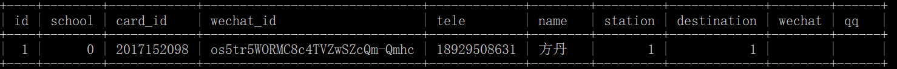
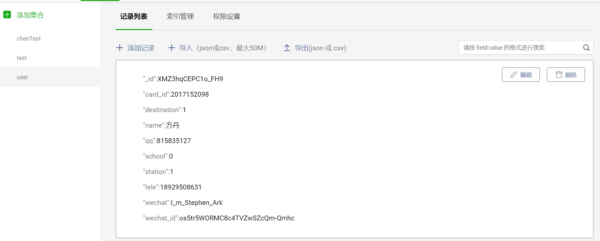

# 第二周任务

## 学会使用云数据库，添加collection，写增、删、查、改四个云函数

1. [增加一个collection](https://developers.weixin.qq.com/miniprogram/dev/wxcloud/guide/database/getting-started.html)
2. 添加一个叫api的文件夹，其下添加一个js，名字随便取



3. 查看[微信官方文档](https://developers.weixin.qq.com/miniprogram/dev/wxcloud/guide/)和自己百度，参考下图在js中写**增删查改**函数，其中查是我写的示例



4. 找到首页的js（就是一进来那个页面，例如home/home.js），在开头添加一行
   ```js
   // 单引号里面的是你写的js的路径
   // 相当于#include
   const test = require('../../api/express')
   ```
5. 找到onLoad函数，在第一行添加
   ```js
   test.db_add();
   test.db_del();
   test.db_get();
   test.db_edit();
   ```
6. 保存编译，查看控制台的信息，以下是示例结果



# 修改任务

## 将服务器数据库搬到云端

打开```server/model.py```，查看数据库模型

这里有两个类，每一个类对应一张表，例如：

```python
class User(db.Model):
    __tablename__ = 'user'  # 表名
    # 属性名 = db.Column(第一个参数是db.类型，其它不用理)
    # 必填项
    id = db.Column(db.Integer, primary_key=True, autoincrement=True)
    school = db.Column(db.Integer, nullable=False)
    card_id = db.Column(db.String(12), nullable=False)
    wechat_id = db.Column(db.String(50), nullable=False)

    # 常用信息（选填）
    name = db.Column(db.String(15), nullable=True)  # 收件人
    station = db.Column(db.Integer, nullable=True)  # 快递站
    destination = db.Column(db.Integer, nullable=True)  # 目的地
    tele = db.Column(db.String(15), nullable=True)  # 电话
    wechat = db.Column(db.String(20), nullable=True)  # 微信
    qq = db.Column(db.String(15), nullable=True)  # QQ
```



对应的在云端添加一个叫user的collection，如上添加一条数据，id可以不用，自动生成的。类型看着填，例如Integer就是number，值可以瞎jb填。




# 修改API

## 增删查改数据库的API移至本地

以添加快递为例：

添加快递页：**addexpress**

addexpress.wxml见下


其中，form是需要填写的表单，里面有一堆输入框之类的组件。bindsubmit既点击了“发布”按钮后会调用的函数，这里函数名为publish。


form展开：


以收件人为例，输入框input的name为"owner"：


addexpress.js中的publish函数：


传入的e就是wxml中的form，e.detail.value为form中的值。要访问表单中组件的值就用e.detail.value.组件name，例如收件人输入框中的值为e.detail.owner。

下面一段是来验证输入的合法性的：


然后向数据库的"express" collection增加一条数据，之前是向服务器发送请求，现改为调用本地api：


expressApi：api/express.js


对数据进行部分处理后，调用cloud_api中的数据库增添函数增加一条数据：


cloud_api是我们之前写好的增删查改：


